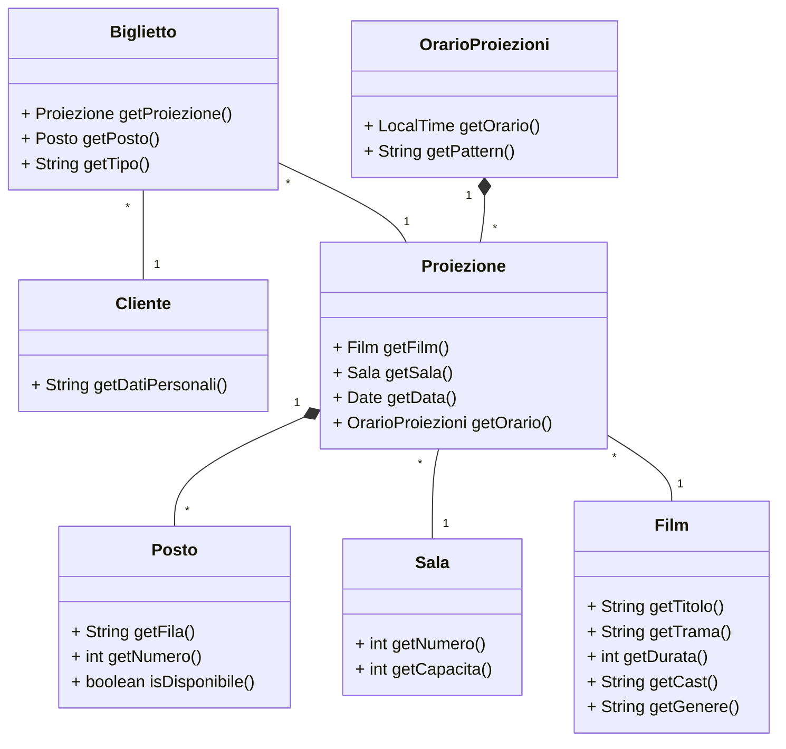
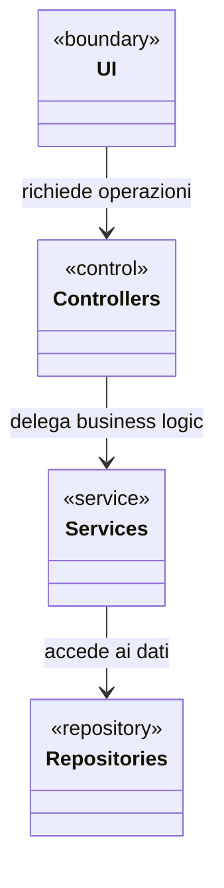
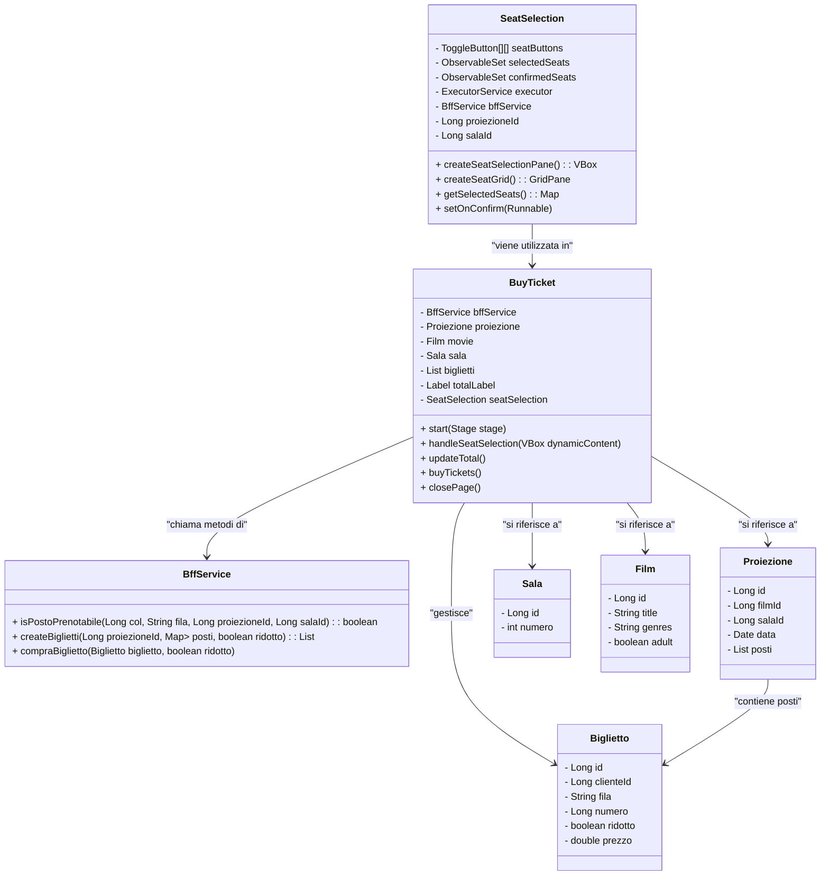
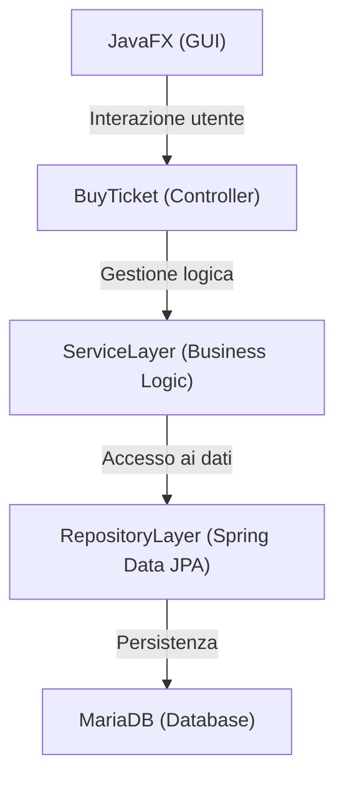
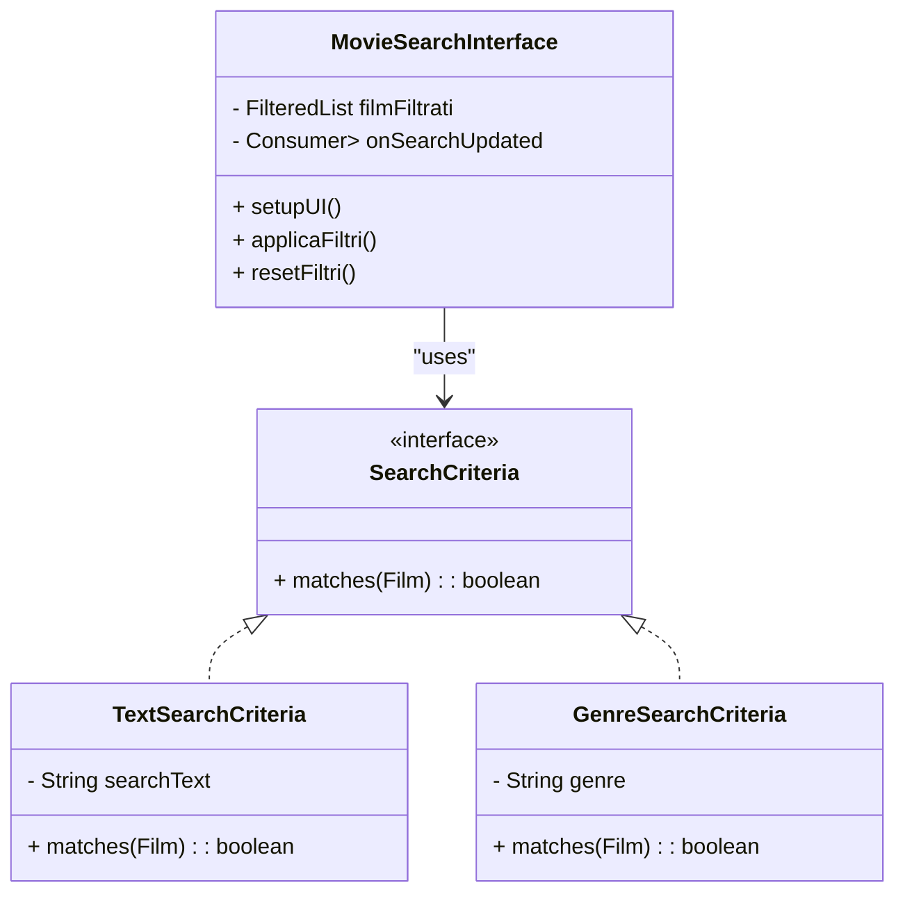
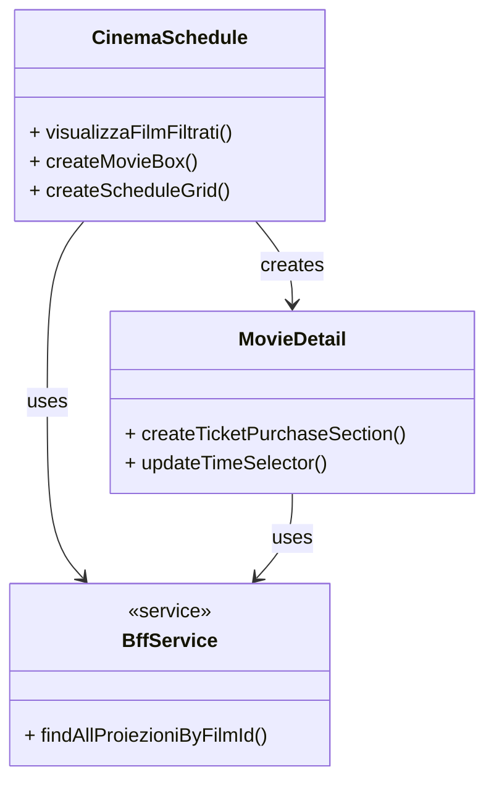
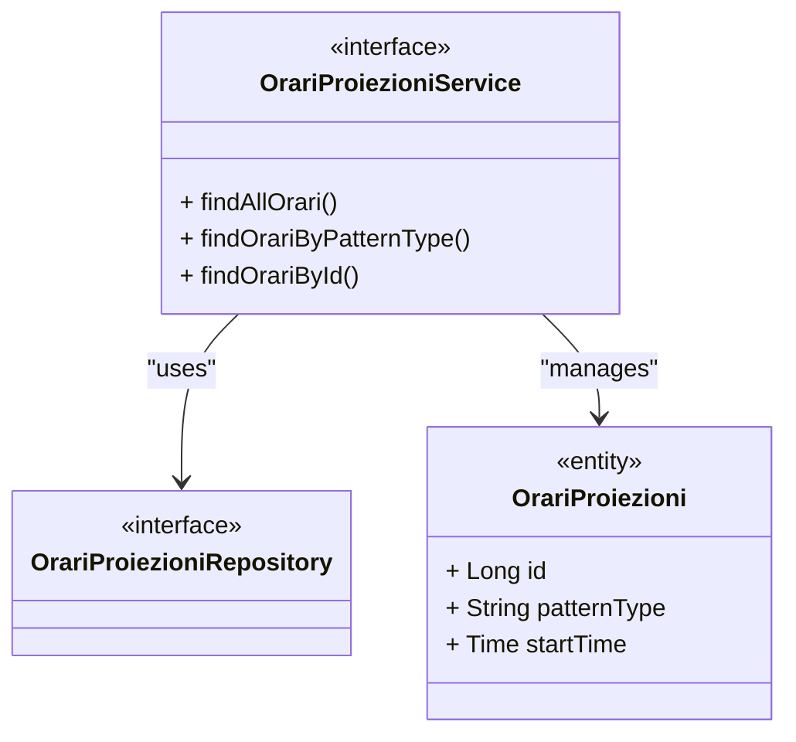
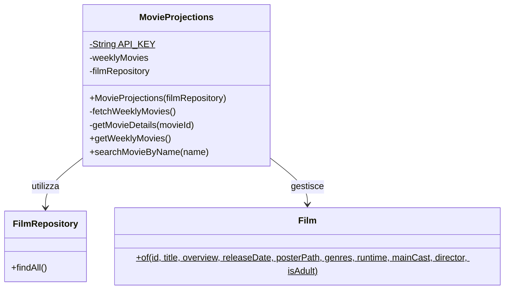
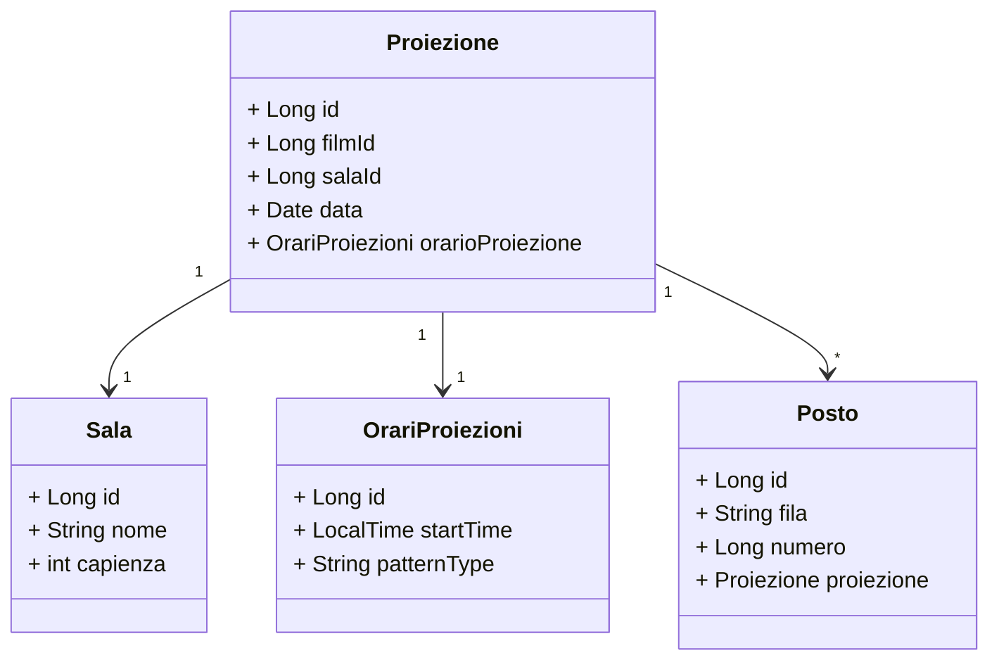
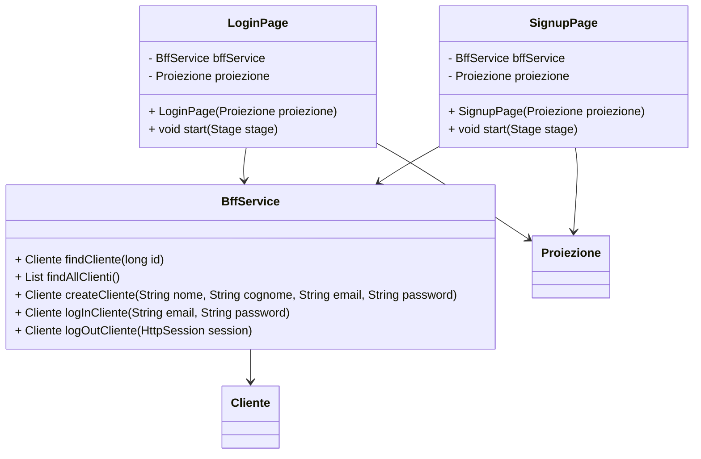

# RELAZIONE PER PROGETTO PROGETTAZIONE E SVILUPPO SOFTWARE

# Analisi

In questo capitolo viene condotta un'analisi dettagliata dei requisiti e del problema. Verranno elencate le funzionalità che l'applicazione dovrà implementare (requisiti) e sarà descritto il dominio applicativo, ovvero il contesto e le esigenze che il software intende soddisfare (analisi del dominio).  

## Requisiti

Il nostro gruppo si è posto l’obiettivo di realizzare un sistema che si occupi della gestione di un cinema.  
Il software deve permettere agli utenti di consultare il palinsesto con la programmazione delle proiezioni fornite dal sistema, è necessario far sì che ogni film sia consultabile attraverso delle schede di dettaglio che l’utente può utilizzare per recuperare principali informazioni sul film che vuole visionare.   
Sarà poi necessaria una sezione dedicata alla scelta di posti e all’acquisto di biglietti.

### Requisiti funzionali

* **Visualizzazione del palinsesto:** L’applicazione deve consentire agli utenti di consultare una programmazione aggiornata dei film in sala, in particolare per ogni proiezione si intende mostrare alcune principali caratteristiche come il film in programmazione, l’orario della proiezione, i posti disponibili.  
    
* **Ricerca dei film:** il sistema sarà progettato per permettere ad ogni utente di effettuare la ricerca dei film attraverso per esempio il nome e/o il genere.  
    
* **Dettagli sui film:** dovrebbe essere possibile per ogni film vedere in dettaglio alcune principali informazioni come il titolo, la trama , la durata e il regista.  
    
* **Scelta delle proiezioni:** in particolare deve essere possibile scegliere film, la data e il relativo orario della proiezione per procedere alla selezione dei posti, il sistema deve mantenere aggiornata in tempo reale la disponibilità dei posti per ogni proiezione, evitando sovrapposizioni nelle prenotazioni.  
    
* **Selezione di posti:** L’applicazione dovrà mostrare in dettaglio una scheda per la selezione dei posti da acquistare e vedere i posti già occupati per una proiezione,   
    
* **Acquisto di biglietti:** il sistema deve permettere ad un utente uno o più biglietti relativi ad un film, previo registrazione o login.

### Requisiti non funzionali

* Il sistema deve essere in grado di gestire l'accesso concorrente di più utenti che tentano di prenotare gli stessi posti.  
    
* L'interfaccia utente deve essere intuitiva, permettendo una facile navigazione tra le diverse funzionalità.  
    
* I dati relativi ai film devono essere mantenuti aggiornati attraverso l'integrazione con database esterni.  
    
* Il sistema deve garantire tempi di risposta rapidi nelle operazioni di ricerca e prenotazione.

---

# **Analisi e modello del dominio**  
Il software dovrà dare la possibilità di ricercare informazioni sui film con il nome o per genere. Ogni film deve avere un nome, una copertina, un regista, un cast, una trama, un anno di uscita, una durata e un genere.  
L’utente potrà quindi leggere queste informazioni all’interno di un palinsesto con orari e sala per ogni proiezione.   
Ogni film avrà più proiezioni in una o più sale e in diversi orari.  
Per ogni proiezione sarà in grado di creare una scelta dei posti a sedere al momento della prenotazione, ed una volta effettuata la scelta, di far acquistare uno o più biglietti.



Le principali complessità del dominio riguardano: 

* la gestione simultanea delle prenotazioni dei posti, poiché più clienti potrebbero tentare di prenotare lo stesso posto contemporaneamente.  
* L'organizzazione ottimale delle proiezioni nelle sale disponibili, considerando la durata dei film e i tempi necessari per il cambio spettacolo.   
* La gestione dei dati relativi ai film, che devono essere accurati e aggiornati.   
* La rappresentazione della disposizione dei posti in sala, che deve rispecchiare fedelmente la realtà fisica del cinema.

Alcune problematiche, come l'integrazione con sistemi di pagamento elettronico e la gestione di abbonamenti, non verranno affrontate in questa fase del progetto per vincoli temporali.

# **Design**

## **Architettura**

Il sistema è stato progettato seguendo un'architettura multi-layer che implementa il pattern MVC (Model-View-Controller), con una chiara separazione tra interfaccia utente, logica di business e accesso ai dati.  
Quando l’utente esegue azioni che richiedono l’interrogazione dei dati nel database, parte una chiamata verso i controller, che si occupano poi di interrogare il service necessario a recuperare o aggiornare i dati, tramite l’utilizzo dei repositories.  
In questo modo, anche andando a fare modifiche alla GUI, l'implementazione della parte backend che tratta i dati rimane indipendente.



L'architettura è organizzata nei seguenti layer:

* **Presentation Layer (UI)**: gestisce l'interfaccia utente.  
* **Controller Layer**: coordina le richieste dell'utente e orchestra le operazioni di business.  
* **Service Layer**: implementa la logica di business e le regole dell'applicazione.  
* **Repository Layer**: gestisce la persistenza e l'accesso ai dati.
---

## **Design dettagliato**

### Alex Lonzi

Il mio ruolo nel progetto ha riguardato principalmente due macro-aree: la gestione della selezione dei posti e l'integrazione con il database tramite Spring. L’obiettivo era quello di realizzare un percorso completo dalla GUI fino alla persistenza dei dati (GUI → Controller → Service → Repositories).

#### Gestione della Selezione dei Posti

**Ruolo e responsabilità:**  
Mi sono occupato interamente della parte relativa alla selezione dei posti, sia dal punto di vista dell'interfaccia grafica (GUI) che dal punto di vista del controller e dell’implementazione delle logiche di business.  
L’obiettivo è consentire all’utente di selezionare i posti disponibili in una sala cinematografica, visualizzando graficamente la disposizione dei posti, evidenziando quelli occupati e permettendo la conferma della selezione. L’interazione avviene tramite una griglia (GridPane) realizzata in JavaFX, e la logica di selezione è gestita in una classe apposita, SeatSelection, che è integrata nella classe BuyTicket(controller) e ci comunica tramite un callback.

**Implementazione e Struttura:**

1. **Interfaccia Grafica (GUI):**  
   * **Layout:**  
     La griglia è realizzata con un GridPane che dispone i posti in 5 colonne e 4 righe, rappresentate dalle lettere *A, B, C, D*.  
   * **Elementi Visivi:**  
     Ogni posto è rappresentato da un ToggleButton incorporato all’interno di uno StackPane assieme a:  
     * Una Label che visualizza il numero del posto (es. “1”, “2”, …).  
     * Un’icona (ImageView) che viene resa visibile nel caso in cui il posto non sia prenotabile (cioè già occupato).  
   * **Asincronia e Verifica Disponibilità:**  
     Per ogni posto viene eseguita in maniera asincrona una chiamata tramite bffService.isPostoPrenotabile() per verificare se il posto è disponibile. Se non lo è, la UI viene aggiornata (tramite Platform.runLater()) per disabilitare il ToggleButton, mostrare l’icona e modificare l’opacità.  
2. **Gestione della Selezione:**  
   * **Tracking della Selezione:**  
     La classe mantiene un ObservableSet\<ToggleButton\> chiamato *selectedSeats*, che raccoglie in tempo reale i posti selezionati dall’utente.  
   * **Conferma della Selezione:**  
     Un pulsante “Conferma Selezione” (inizialmente disabilitato) viene abilitato ogni qualvolta la selezione corrente differisce dalla selezione confermata (gestita tramite un ulteriore set, *confirmedSeats*). Al click, viene invocato un callback (assegnabile tramite il setter onConfirm) che permette al controller(BuyTicket) di reagire alla conferma.  
   * **Stilizzazione al Click:**  
     Quando un posto viene selezionato, il relativo ToggleButton cambia stile (ad es. colore di sfondo verde) per evidenziare la selezione; al contrario, quando viene deselezionato, lo stile torna a uno stato predefinito.  
3. **Mappatura della Selezione (metodo getSelectedSeats()):**  
   * **Costruzione della Mappa:**  
     Il metodo scorre l’insieme dei ToggleButton selezionati e, per ciascuno, individua la posizione (riga e colonna) nella matrice.  
   * **Struttura dei Dati:**  
     Viene creata una mappa di tipo Map\<Long, String\> in cui la chiave (di tipo Long) rappresenta il numero di colonna (colonna \+ 1\) e il valore è una stringa che contiene le lettere delle righe dei posti selezionati in quella colonna. Se in una stessa colonna vengono selezionati più posti, le lettere vengono concatenate separandole da una virgola (ad esempio, {3: "A,B"}).  
4. **Integrazione col Controller:**  
   * **Comunicazione:**  
     La classe *SeatSelection* espone il metodo createSeatSelectionPane(), che restituisce un VBox contenente la griglia dei posti e il pulsante di conferma.  
   * **Callback:**  
     Il controller (*BuyTicket*) imposta il callback tramite il setter setOnConfirm() in modo che, al click di “Conferma Selezione”, venga eseguita la logica di elaborazione della prenotazione (ad es. creazione dei biglietti).

**Rappresentazione UML:**



**Problema affrontato:**

* **Gestione della selezione e mappatura:**  
  Era necessario mappare correttamente la selezione dei posti in una struttura dati (mappa) che potesse essere interpretata dal Service per la creazione dei biglietti.  
* **Soluzione:**  
  Utilizzo di una mappa con chiave la colonna e valore una stringa di righe (ad esempio "A,B") per rappresentare la scelta multipla in una stessa colonna. Il controller di BuyTicket converte questa stringa in una lista e la passa al servizio per l'elaborazione.

#### Integrazione con il Database tramite Spring

**Ruolo e responsabilità:**  
Parallelamente alla gestione della GUI e delle logiche di business, mi sono occupato dell'interazione dell'intero progetto con il database. In particolare, ho integrato il progetto con un database MariaDB (utilizzato in XAMPP) sfruttando le annotazioni di **Spring** per definire le entità e le relazioni.

* **Definizione del modello dati:**  
  Dopo una prima definizione delle classi di modello (Proiezione, Posto, ecc.), non fatta solamente da me, le ho integrate con annotazioni di JPA (come @Entity, @Table, @OneToMany, @ManyToOne) in modo da mappare correttamente le tabelle del database.  
  1. **Esempio:**  
     La classe Posto è associata a una Proiezione tramite una relazione many-to-one. Ho introdotto un campo booleano prenotato per distinguere i posti liberi da quelli già prenotati, evitando che, al momento della creazione, ogni posto risulti automaticamente prenotato.  
* **Percorso completo dati (GUI → Controller → Service → Repository):**  
  La struttura architetturale dell'applicazione è organizzata nel seguente modo:  
  1. **GUI:**  
     L’utente interagisce con l’interfaccia grafica realizzata in JavaFX per selezionare i posti.  
  2. **Controller:**  
     Gli eventi dalla GUI vengono gestiti dal controller (es. BuyTicket), il quale raccoglie i dati di selezione e li inoltra al Service.  
  3. **Service:**  
     Il Service contiene le logiche di business per creare biglietti, gestire la prenotazione dei posti e validare le operazioni.  
  4. **Repository:**  
     Infine, il Repository (implementato tramite Spring Data JPA) si occupa dell’accesso e della persistenza dei dati sul database MariaDB.

**Rappresentazione UML (Diagramma architetturale semplificato):**



**Problemi affrontati:**

* **Mapping corretto delle entità e delle relazioni:**  
  1. All’inizializzazione, i posti venivano considerati automaticamente prenotati se associati a una proiezione.   
  2. Veniva creata una ricorsione circolare.  
* **Soluzione:**  
  1. Introduzione del campo boolean prenotato in Posto e ristrutturazione della relazione in Proiezione, in modo da avere un’unica lista di posti che contenga lo stato (prenotato/non prenotato) per ogni posto.  
  2. Tramite il tag @JsonIgnoreProperties("posti") sul campo “proiezione” in Posto, ignoro il lato opposto della relazione, evitando così di risolvere il campo in Proiezione che creerebbe la ricorsione circolare.

### **Conclusioni**

Il mio intervento nel progetto ha riguardato:

* La **gestione della selezione dei posti**, dalla realizzazione della GUI con JavaFX fino all’implementazione del controller e delle logiche di business per creare e confermare la prenotazione dei biglietti.  
* L’**integrazione con il database** tramite Spring, definendo le classi di modello che rappresentano le tabelle e le relazioni del database, e garantendo un corretto flusso dati attraverso l’architettura MVC (GUI → Controller → Service → Repository).

Preciso che dopo un’integrazione iniziale di Spring e dei relativi tag non sono stato l’unico ad utilizzarlo e gestirlo.

---

### Andrea Pagani

Il mio ruolo nel progetto si è concentrato su due aree principali: il sistema di ricerca e filtraggio dei film e la gestione del palinsesto cinematografico. Ho progettato e implementato delle soluzioni che permettessero agli utenti di trovare facilmente i contenuti di interesse e visualizzare la programmazione in modo chiaro ed efficiente.

### **Gestione della Ricerca Film**

#### **Problema**

Era necessario implementare un sistema di ricerca flessibile ed efficiente che permettesse agli utenti di trovare rapidamente i film di interesse. Le sfide principali erano:

* Gestire diversi criteri di ricerca (testuale e per genere) mantenendo le performance  
* Aggiornare l'interfaccia in tempo reale durante la ricerca  
* Mantenere una struttura modulare e facilmente estensibile  
* Ottimizzare le prestazioni con dataset potenzialmente grandi

#### **Soluzione**

Ho implementato un sistema basato sul pattern Observer per la gestione degli aggiornamenti della ricerca, combinato con il pattern Strategy per i criteri di filtro. Il sistema utilizza FilteredList di JavaFX per gestire il filtering reattivo e implementa un sistema di caching per ottimizzare le performance.



Il sistema utilizza il pattern Observer per notificare i cambiamenti nella ricerca attraverso il Consumer\<List\<Film\>\>, permettendo un aggiornamento reattivo dell'interfaccia utente quando i criteri di ricerca cambiano.

### **Gestione del Palinsesto**

#### **Problema**

La visualizzazione del palinsesto richiedeva la gestione di una grande quantità di dati correlati (film, proiezioni, orari) e doveva garantire una presentazione chiara e organizzata delle informazioni. Le sfide includevano:

* Organizzazione efficiente di grandi quantità di dati  
* Gestione delle relazioni tra film e proiezioni  
* Aggiornamento in tempo reale delle informazioni  
* Interfaccia utente responsive e intuitiva

#### **Soluzione**

Ho implementato una soluzione basata sul pattern Composite per la strutturazione gerarchica delle informazioni del palinsesto, combinata con il pattern Proxy per la gestione efficiente del caricamento dei dati.



La soluzione utilizza un sistema di caching per le proiezioni per ottimizzare le performance e ridurre le chiamate al servizio.

### **Gestione degli Orari**

#### **Problema**

Il sistema doveva gestire complessi pattern di orari per le proiezioni, considerando diverse fasce orarie e giorni della settimana. Le sfide principali erano:

* Gestire diversi pattern di programmazione (feriale/festivo)  
* Evitare sovrapposizioni di proiezioni  
* Ottimizzare l'utilizzo delle sale  
* Mantenere flessibilità per eventi speciali o modifiche alla programmazione

#### **Soluzione**

Ho implementato una soluzione basata sul pattern Template Method per standardizzare la gestione degli orari, permettendo variazioni specifiche per giorni feriali e festivi.



Questa struttura permette una gestione flessibile degli orari e facilita eventuali future estensioni del sistema, come l'aggiunta di nuovi pattern di programmazione o regole specifiche per eventi speciali.

---

### Francesco Ridolfi

Nel gruppo il mio ruolo è stato quello del recupero dei Film da esporre all’interno del palinsesto nell’applicativo, questo attraverso l’utilizzo librerie pubbliche e database online, e della creazione delle relative proiezioni sulla base dei film presenti nella programmazione settimanale.  
L’obiettivo preposto era quello di implementare un Service che generasse metodi in grado di sfruttare le API fornite dalla libreria, per estrarre film settimanali e le relative informazioni generando una classe Film, andando poi ad occuparmi della gestione della creazione di proiezioni all’interno del database attraverso le implementazioni di metodi e controller specifici.

### **Recupero dei Film:**

#### **Problema:**

 Consentire al sistema la gestione e il recupero delle informazioni sui film proiettati nel cinema, per questo ho deciso di integrare il database online di film: The Movie Database (TMDb).  
Il problema principale è stato quindi come recuperare e gestire in modo efficiente i dati dei film evitando ridondanze e garantendo un aggiornamento coerente del palinsesto, inoltre era importante come sfida quella di fornire al sistema sincronizzazione tra database locale e dati esterni.  

#### **Soluzione:**

 Per risolvere questo problema, è stata implementata il service ‘MovieProjections’, che ha il compito di recuperare la lista dei film settimanali dal database locale per ridurre le chiamate API.    
Ottenere i dettagli di un film specifico, inclusi genere, cast e durata ed altre informazioni come poster illustrativi da mostrare all’interno della lista di film e nel dettaglio, tramite chiamate REST a TMDb API, fornendo un sistema di caching per velocizzare le ricerche e ridurre il carico.   
Ho generato poi un file ‘MovieChangesetGenerator’ che recupera i film settimanali da ‘MovieProjections’ e crea un changelog con tutte le informazioni sui film.  
Si è optato per una soluzione ibrida, in cui il database locale è la fonte primaria, ma viene aggiornato periodicamente con i dati di TMDb.  

#### **Altre soluzioni considerate:**

**Recupero diretto:** con un recupero diretto da TMDb a ogni richiesta, si avrebbero i dati sempre aggiornati ma un alto carico sulle API e quindi possibili rallentamenti di sistema.

**Utilizzo di db locale**: Strutturando e generando un database locale sicuramente si eviterebbero tante logiche utilizzate e la velocità sarebbe elevata ma il problema sarebbe il costo di tempo e risorse per aggiungere costantemente i film e il rischio che questi potrebbero diventare obsoleti senza aggiornamenti costanti.

#### **Rappresentazione UML:**



#### **Pattern utilizzati:**

**Repository Pattern:** Il Repository Pattern  è stato adottato per separare la logica di accesso ai dati dal resto dell’applicazione.    
\- \`FilmRepository\` gestisce il recupero e la memorizzazione dei film nel database.    
\- \`MovieProjections\` si occupa della logica di aggiornamento dei film e  del relativo caching.    
\- Questo approccio garantisce modularità e facilita la sostituzione della sorgente dati in futuro.  

**Singleton Pattern :** Per la gestione delle API ho fatto si che la connessione all’API TMDb è gestita da un singleton, evitando di istanziare più client HTTP.  

#### **Conclusione**:

La progettazione del modulo di gestione dei film bilancia aggiornamento e prestazioni grazie all'uso di un'architettura ibrida e di design pattern noti.  
 Il sistema è modulare, estensibile e pronto a supportare future evoluzioni senza impattare le funzionalità esistenti.

### **Generazione Proiezioni:**

#### **Problema:**

Il problema richiede di gestire la creazione e gestione delle proiezioni in un sistema di acquisto di biglietti per il cinema, le principali sfide sono far sì che le proiezioni non si sovrappongano nella stessa sala e nello stesso orario, rendere i dati coerenti e facilmente accessibili in fase di prenotazione.  
In generale è richiesto recuperare i film presi dalle API e salvati nel db locale, e in base ai film, agli orari di proiezione definiti ed alle sale disponibili generare proiezioni correttamente gestibili in fase di prenotazione.

#### **Soluzione:**

Per gestire queste proiezioni ho adottato una soluzione basata sull’utilizzo dell’entity Proiezione che utilizza il riferimento identificativo del film, quello della sala e un identificativo dell’orario deciso con un pattern preciso.  
Interrogando *proiezioneRepository* vado ad utilizzare metodi per interrogare il database con i film salvati garantendo unicità delle proiezioni per data, sala ed orario.  
Con il metodo *generateProjections()* genero automaticamente le proiezioni per i film, garantendo assenza di sovrapposizioni utilizzando un pattern type di orari in linea con quelle del repository *orariProiezioni* ed ottimizzando l’assegnazione delle sale controllando quelle occupate in un determinato giorno.  
Infine con il metodo *findAvaibleSala()* determino la disponibilità di una sala in base alla durata di un film per un determinato orario e genero automaticamente i posti associati per ogni proiezione con *createPosti()*.  
In particolare ho adottato caching degli orari di proiezioni e ho deciso di salvare le proiezioni in batch per ottimizzare l’accesso ai dati con meno query al database, in quanto creava grossi rallentamenti al programma.

#### **Altre soluzioni considerate:**

**Validazione a livello di applicazione**: Verificare la disponibilità di sala e orario nel servizio applicativo prima di salvare la proiezione. Contro: possibilità di inconsistenza in caso di accessi concorrenti.

**Vincoli a livello di database**: Definire chiavi uniche su data, salaId e orarioProiezioneId. Contro: minore flessibilità in caso di modifiche future alle regole di validazione.

#### **Rappresentazione UML:**



#### **Pattern Utilizzati:**

**Repository Pattern**: Il ProiezioneRepository si occupa di tutte le operazioni di accesso ai dati, separando la logica di business dall’interazione con il database.

**Builder Pattern**: nella classe Proiezione si utilizza il pattern Builder (@Builder) per facilitare la creazione di istanze in modo leggibile e manutenibile.

Con questo design si permette facilità di estensione del progetto (per esempio: gestione di offerte speciali, proiezioni in formato diverso ecc.) inoltre garantisce separazione delle responsabilità dividendo il repository che gestisce l’accesso ai dati e gestendo la logica di business in servizi separati.

#### **Conclusione:**

Il design adottato per la gestione delle proiezioni è stato pensato per garantire coerenza, scalabilità ed estensibilità, l’utilizzo di pattern consolidati e validazioni appropriate riduce il rischio di errori e permette future evoluzioni del progetto senza impattare negativamente sulle performance del sistema.

---

### Luca Signorini

Il mio ruolo all’interno del gruppo ha riguardato due macro-aree: l’acquisto dei biglietti e la gestione delle utenze con relativo log in e sing up.

Per quanto riguarda l'acquisto dei biglietti, l’obiettivo era creare una pagina che presentasse in modo chiaro tutte le informazioni essenziali riguardanti la proiezione. Dopo aver selezionato i posti e scelto la tipologia di biglietto (intero o ridotto), l’utente doveva poter procedere con l'acquisto. In questa fase mi sono occupato di strutturare la pagina e di implementarne il funzionamento, successivamente perfezionato da Alex, che ha integrato la schermata per la scelta dei posti.

Per la gestione degli utenti, invece, l’obiettivo era fornire delle pagine dedicate al login e alla registrazione, in modo da identificare correttamente il cliente al momento dell’acquisto.  
Sono state valutate due alternative per implementare l’accesso. La prima prevedeva l'inserimento di un pulsante “Accedi” nella schermata principale, con il salvataggio della sessione tramite la libreria HttpSession, strumento che sarebbe diventato essenziale per l’identificazione dell’utenza. La seconda, scelta e implementata, consisteva nell’aprire la schermata di accesso solo quando l’utente richiedeva pagine che necessitavano tale autenticazione. Questa decisione è stata adottata per evitare l’aggiornamento della pagina principale, che sarebbe risultato lento, ottenendo così un’applicazione più reattiva, sebbene richiedesse il login per ogni acquisto.

#### **Rappresentazione UML:**

All’interno della classe BffService è presente anche il metodo logOutCliente, volutamente lasciato per semplificare l’aggiornamento dell’applicazione nel momento in cui si cambi idea sulla scelta precedentemente effettuata.



# **Sviluppo**

## **Testing automatizzato**

Per garantire la qualità e l'affidabilità del software, sono stati implementati test automatizzati utilizzando JUnit 5 e Mockito. I test si concentrano sul layer dei servizi, che contiene la logica di business principale dell'applicazione.

I componenti sottoposti a testing automatizzato sono:

1. **BigliettoService**: verifica la corretta gestione dell'acquisto dei biglietti, testando:  
   * Calcolo dei prezzi per biglietti interi e ridotti  
   * Processo di acquisto biglietto con prenotazione posto  
   * Gestione degli errori durante l'acquisto  
2. **PostoService**: verifica la gestione dei posti in sala, testando:  
   * Controllo disponibilità dei posti  
   * Conteggio dei posti prenotati per proiezione  
3. **ProiezioneService**: verifica la gestione delle proiezioni, testando:  
   * Verifica disponibilità posti per una proiezione  
   * Calcolo dei posti liberi in sala

I test utilizzano Mockito per simulare le dipendenze, permettendo di isolare completamente i componenti testati e garantire test unitari affidabili. Ogni test è completamente automatizzato e non richiede intervento manuale.

## **Note di sviluppo**

### Alex Lonzi

### **1\. Uso di ObservableSet per tracciare la selezione dei posti**

**Dove:** Classe SeatSelection, package it.unibo.samplejavafx.ui

**Permalink:** https://github.com/Alonzi20/cinemaJava/blob/master/src/main/java/it/unibo/samplejavafx/ui/SeatSelection.java

**Snippet:**

```java
private final ObservableSet\<ToggleButton\> selectedSeats \= FXCollections.observableSet();  
private final ObservableSet\<ToggleButton\> confirmedSeats \= FXCollections.observableSet();

selectedSeats.addListener(  
    (SetChangeListener\<ToggleButton\>) change \-\> {  
        boolean isSelectionChanged \= \!selectedSeats.equals(confirmedSeats);  
        confirmButton.setDisable(\!isSelectionChanged);  
    }  
);
```

**Descrizione:** Ho utilizzato ObservableSet di JavaFX per tenere traccia dinamicamente dei posti selezionati dall’utente. Questo consente di aggiungere o rimuovere posti senza dover aggiornare manualmente una lista. Grazie al SetChangeListener, il pulsante di conferma viene abilitato solo quando la selezione effettiva cambia, migliorando l’interattività dell’interfaccia.

---

### **2\. Gestione asincrona con ExecutorService e aggiornamento UI con Platform.runLater()**

**Dove:** Classe SeatSelection, package it.unibo.samplejavafx.ui

**Permalink:** https://github.com/Alonzi20/cinemaJava/blob/master/src/main/java/it/unibo/samplejavafx/ui/SeatSelection.java

**Snippet:**

```java
executor.execute(() \-\> {  
    boolean isPrenotabile;  
    try {  
        isPrenotabile \= bffService.isPostoPrenotabile(finalCol \+ 1L, ROWS\[finalRow\], proiezioneId, salaId);  
    } catch (Exception e) {  
        throw new RuntimeException(e);  
    }

    Platform.runLater(() \-\> {  
        if (\!isPrenotabile) {  
            seatButton.setDisable(true);  
            personIcon.setVisible(true);  
            seatNumber.setVisible(false);  
            seatButton.setOpacity(0.7);  
        }  
    });  
});
```

**Descrizione:** Per la verifica dei posti disponibili ho utilizzato ExecutorService per eseguire operazioni in background, evitando di bloccare il thread della UI. Poiché JavaFX non permette aggiornamenti diretti alla UI da thread secondari, ho usato Platform.runLater() per modificare gli elementi dell’interfaccia grafica in modo sicuro.

---

### **3\. Integrazione con Spring Data JPA e mapping delle entità con annotazioni JPA**

**Dove:** Classi in Models come classe Posto, package it.unibo.samplejavafx.cinema.application.models

**Permalink:** https://github.com/Alonzi20/cinemaJava/tree/master/src/main/java/it/unibo/samplejavafx/cinema/application/models/Posto.java

**Snippet:**

```java
@Entity  
@Data  
@Builder(toBuilder \= true)  
@ToString(onlyExplicitlyIncluded \= true)  
@Getter  
@Setter  
@NoArgsConstructor  
@AllArgsConstructor(staticName \= "of", access \= AccessLevel.PRIVATE)  
@EqualsAndHashCode(onlyExplicitlyIncluded \= true)  
public class Posto {  
  @Id  
  @GeneratedValue(strategy \= GenerationType.IDENTITY)  
  private Long id;

  private Long numero;  
  private String fila;

  @ManyToOne  
  @JoinColumn(name \= "proiezione\_id", nullable \= false)  
  @JsonIgnoreProperties("posti")  
  private Proiezione proiezione;

  @Column(nullable \= false)  
  private boolean prenotato \= false;  
}
```

**Descrizione:** Ho definito l'entità Posto utilizzando le annotazioni di **Spring Data JPA**, garantendo un mapping corretto con il database. In particolare, ho:

* Utilizzato @Entity per dichiarare la classe come tabella del database.  
* Impostato @GeneratedValue(strategy \= GenerationType.IDENTITY) per la gestione automatica dell'ID.  
* Definito la relazione @ManyToOne con Proiezione, evitando problemi di serializzazione e ricorsione circolare con @JsonIgnoreProperties.  
* Aggiunto il campo boolean prenotato per distinguere i posti liberi da quelli prenotati, semplificando le query senza necessità di una lista separata.

---

### **Codice di terze parti utilizzato**

Per lo sviluppo non ho utilizzato direttamente codice di terze parti senza opportuna modifica e adattamento al contesto del progetto (ho utilizzato ChatGPT per velocizzare alcune integrazioni di funzionalità, ma rielaborando), ma ho attinto alla struttura che utilizzo a lavoro per la gestione dei dati.

---

### Andrea Pagani

### **1\. Utilizzo di FilteredList con Stream API**

**Dove**: it.unibo.samplejavafx.ui.MovieSearchInterface

**Permalink:** https://github.com/Alonzi20/cinemaJava/blob/febe049c45d2a683851e18c30415395c6ee69669/src/main/java/it/unibo/samplejavafx/ui/MovieSearchInterface.java#L35

```java
this.filmsConProiezioni \= films.stream()  
    .filter(film \-\> film.getId() \!= null)  
    .filter(film \-\> {  
        try {  
            List\<Proiezione\> proiezioni \= bffService.findAllProiezioniByFilmId(film.getId());  
            if (\!proiezioni.isEmpty()) {  
                proiezioniCache.put(film.getId(), proiezioni);  
                return true;  
            }  
            return false;  
        } catch (Exception e) {  
            System.err.println("Errore nel recupero delle proiezioni per il film " \+  
                    film.getTitle() \+ ": " \+ e.getMessage());  
            return false;  
        }  
    })  
    .collect(Collectors.toList());
```

Utilizzo avanzato della Stream API combinato con FilteredList di JavaFX per implementare un sistema di filtraggio reattivo. La soluzione permette di:

* Eseguire filtri concatenati in modo funzionale  
* Effettuare il caching automatico delle proiezioni durante il filtraggio  
* Gestire gli errori in modo graceful senza interrompere il flusso di filtri  
* Mantenere le performance con dataset di grandi dimensioni 

---

### **2\. Cache System con HashMap**

**Dove**: it.unibo.samplejavafx.ui.MovieSearchInterface

**Permalink:** https://github.com/Alonzi20/cinemaJava/blob/febe049c45d2a683851e18c30415395c6ee69669/src/main/java/it/unibo/samplejavafx/ui/MovieSearchInterface.java#L58

```java
private final Map\<Long, List\<Proiezione\>\> proiezioniCache;

public List\<Proiezione\> getProiezioniForFilm(Long filmId) {  
    return proiezioniCache.getOrDefault(filmId, Collections.emptyList());  
}
```

Ho sviluppato un sistema di caching che:

* per ottimizzare le performance evitando chiamate ripetute al servizio delle proiezioni  
* Implementa il pattern Null Object con Collections.emptyList() per evitare null checks  
* Riduce il carico sul servizio backend evitando chiamate ridondanti  
* Mantiene la consistenza dei dati attraverso l'intero ciclo di vita dell'applicazione

---

### **3\. Sistema di Layout Dinamico**

**Dove**: it.unibo.samplejavafx.ui.CinemaSchedule

**Permalink:** https://github.com/Alonzi20/cinemaJava/blob/febe049c45d2a683851e18c30415395c6ee69669/src/main/java/it/unibo/samplejavafx/ui/CinemaSchedule.java#L168

```java
ScrollPane root \= new ScrollPane();  
root.setFitToWidth(true);  
root.setFitToHeight(true);  
container \= new VBox(10);  
container.setPadding(new Insets(20));  
container.getStyleClass().add("container");  
container.setPrefWidth(Region.USE\_COMPUTED\_SIZE);  
container.setMaxWidth(Double.MAX\_VALUE);
```

Ho implementato un sistema di layout avanzato che:

* Utilizza ScrollPane per gestire contenuti di dimensioni variabili  
* Sfrutta VBox per un allineamento verticale flessibile dei componenti  
* Implementa ridimensionamento dinamico con Region.USE\_COMPUTED\_SIZE  
* Garantisce una user experience consistente su diverse risoluzioni dello schermo

---

### **4\. Utilizzo di Consumer per Callback Functions**

**Dove:** it.unibo.samplejavafx.ui.MovieSearchInterface

**Permalink:** https://github.com/Alonzi20/cinemaJava/blob/febe049c45d2a683851e18c30415395c6ee69669/src/main/java/it/unibo/samplejavafx/ui/MovieSearchInterface.java#L27

```java
private final Consumer\<List\<Film\>\> onSearchUpdated;

public MovieSearchInterface(List\<Film\> films, Consumer\<List\<Film\>\> onSearchUpdated) {
    this.onSearchUpdated \= onSearchUpdated;
}
```

Implementazione di callback functions attraverso l'interfaccia Consumer di Java, permettendo una gestione degli eventi di ricerca flessibile e type-safe.

### 

### **Librerie di Terze Parti Utilizzate**

* JavaFX : Per l'implementazione dell'interfaccia grafica

* Spring Framework: Per la gestione delle dipendenze e dei servizi

* Mockito: Sfruttato per simulare il comportamento dei servizi tramite test unitari

* Lombok: Per la riduzione del boilerplate code nei modelli


### Francesco Ridolfi

1. ### **Recupero film da API con HTTPClient**

**Dove**: it.unibo.samplejavafx.cinema.services.MovieProjections

**Permalink:** https://github.com/Alonzi20/cinemaJava/blob/0d133aedd638ed49ce70c06e8e68a61c5e69b66e/src/main/java/it/unibo/samplejavafx/cinema/services/MovieProjections.java\#L52

**Snippet:**  

```java
private Film getMovieDetails(int movieId) {  
    OkHttpClient client \= new OkHttpClient();  
      
    Request detailsRequest \= new Request.Builder()  
        .url("https://api.themoviedb.org/3/movie/" \+ movieId \+ "?api\_key=" \+ API\_KEY \+ "\&language=it-IT")  
        .get()  
        .addHeader("accept", "application/json")  
        .build();  
      
    try (Response response \= client.newCall(detailsRequest).execute()) {  
        if (response.isSuccessful() && response.body() \!= null) {  
            JSONObject movieDetails \= new JSONObject(response.body().string());  
            return Film.of(  
                null,  
                movieDetails.getString("title"),  
                movieDetails.getString("overview"),  
                movieDetails.getString("release\_date"),  
                movieDetails.getString("poster\_path"),  
                movieDetails.getJSONArray("genres").toString(),  
                movieDetails.getInt("runtime"),  
                "", // Cast e regista vengono gestiti separatamente  
                "",  
                movieDetails.getBoolean("adult")  
            );  
        }  
    } catch (IOException e) {  
        log.error("Errore durante il recupero dei dettagli del film", e);  
    }  
    return null;  
}
```

**Descrizione:**  
Viene utilizzata la libreria OkHttpClient per effettuare richieste HTTP in modo asincrono ed efficiente, ciò permette di recuperare i dettagli dei film dalle API esterne di ‘TMDB’ senza bloccare il thread principale. Inoltre, l'uso di try-with-resources garantisce che la connessione venga chiusa correttamente.

---

2. ### **Utilizzo di StackPane per sovrapporre elementi UI**

**Dove**: it.unibo.samplejavafx.ui.seatselection

**Permalink:** https://github.com/Alonzi20/cinemaJava/blob/0d133aedd638ed49ce70c06e8e68a61c5e69b66e/src/main/java/it/unibo/samplejavafx/ui/SeatSelection.java\#L125

**Snippet:**  

```java
StackPane seatStack \= new StackPane();  
        seatStack.getChildren().addAll(seatButton, seatNumber, personIcon);

        int finalRow \= row;  
        int finalCol \= col;  
        executor.execute(() \-\> {  
          boolean isPrenotabile;  
          try {  
            isPrenotabile \= bffService.isPostoPrenotabile(  
                    finalCol \+ 1L, ROWS\[finalRow\], proiezioneId, salaId);  
          } catch (Exception e) {  
            throw new RuntimeException(e);  
          }

          //aggiorna ui  
          Platform.runLater(() \-\> {  
            if (\!isPrenotabile) {  
              seatButton.setDisable(true);  
              personIcon.setVisible(true);  
              seatNumber.setVisible(false);  
              seatButton.setOpacity(0.7);  
            }  
          });  
        });
```

**Descrizione:**  
Ho utilizzto StackPane di JavaFX per gestire la sovrapposizione di più elementi grafici (pulsante posto, numero del posto e icona di occupazione), migliorando la leggibilità e la gestione dei componenti.

---

3. ### **Generazione automatica delle proiezioni gestendo sale e orari**

**Dove**: it.unibo.samplejavafx.cinema.services.proiezione.proiezioneserviceimpl

**Permalink:** https://github.com/Alonzi20/cinemaJava/blob/0d133aedd638ed49ce70c06e8e68a61c5e69b66e/src/main/java/it/unibo/samplejavafx/cinema/services/proiezione/ProiezioneServiceImpl.java\#L160

**Snippet:**  

```java
long countExistingProiezioni \= proiezioneRepository.countByFilmIdIn(filmIds);  
if (countExistingProiezioni \> 0\) {  
    log.info("Proiezioni già presenti per questi film. Skip della generazione.");  
    return Collections.emptyList();  
}
```

**Descrizione:**  
Il sistema verifica se esistono già proiezioni per i film selezionati prima di generarne di nuove, grazie a ciò si evitano duplicazioni e si migliora l'efficienza del database.

---

4. ### **Utilizzo di ‘Optional’ per l’assegnazione delle sale disponibili del db**

**Dove**: it.unibo.samplejavafx.cinema.services.proiezione.proiezioneserviceimpl

**Permalink:** https://github.com/Alonzi20/cinemaJava/blob/0d133aedd638ed49ce70c06e8e68a61c5e69b66e/src/main/java/it/unibo/samplejavafx/cinema/services/proiezione/ProiezioneServiceImpl.java\#L272

**Snippet:**  

```java
private Optional\<Long\> findAvailableSala(List\<Long\> salaIds, Map\<Integer, Set\<LocalTime\>\> salaOccupata,  
      LocalDate currentDate, LocalTime startTime, int filmDuration) {  
    for (Long salaId : salaIds) {  
        Set\<LocalTime\> orariOccupati \= salaOccupata.getOrDefault(salaId.intValue(), new HashSet\<\>());  
        boolean isAvailable \= orariOccupati.stream()  
            .noneMatch(orario \-\> \!startTime.plusMinutes(filmDuration).isBefore(orario) &&  
                \!orario.plusMinutes(filmDuration).isBefore(startTime));  
        if (isAvailable) {  
            return Optional.of(salaId);  
        }  
    }  
    return Optional.empty();  
}
```

**Descrizione:**  
L'uso di Optional evita il ritorno di null, riducendo il rischio di NullPointerException e migliorando la sicurezza del nostro codice.

---

### **Librerie di Terze Parti Utilizzate:**

* **OkHttp**: Per effettuare chiamate HTTP verso le API di TMDB  
* **TMDB** (“The Movie Database API”): Per il recupero delle informazioni sui film  
* **Mockito**: Per la simulazione delle dipendenze nei test

### Luca Signorini

### Utilizzo della libreria JavaFX

**Dove:**   
it.unibo.samplejavafx.ui.LoginPage

**Permalink:** https://github.com/Alonzi20/cinemaJava/blob/master/src/main/java/it/unibo/samplejavafx/ui/LoginPage.java

**Snippet:**

```java
    Button loginButton \= new Button("Accedi");  
    loginButton.getStyleClass().add("detail-button");

    Button signupButton \= new Button("Registrati");  
    signupButton.getStyleClass().add("detail-button");  
    grid.add(signupButton, 0, 3);

    HBox loginContainer \= new HBox();  
    loginContainer.setAlignment(Pos.CENTER);  
    loginContainer.getChildren().add(loginButton);

    HBox signupContainer \= new HBox();  
    signupContainer.setAlignment(Pos.CENTER);  
    signupContainer.getChildren().add(signupButton);

    grid.add(loginContainer, 0, 2, 2, 1);  
    grid.add(signupContainer, 0, 3, 2, 1);
```

**Descrizione:**  
Per rendere i bottoni centrati all'interno della griglia del form di accesso sono stati inseriti in dei container, grazie a questo si può utilizzare lo span fornito da grid.add() che occupa le due colonne senza compromettere estetica e funzionamento.

---

### Utilizzo di lambda expression

**Dove:**  
it.unibo.samplejavafx.ui.LoginPage

**Permalink:** [https://github.com/Alonzi20/cinemaJava/blob/master/src/main/java/it/unibo/samplejavafx/ui/LoginPage.java](https://github.com/Alonzi20/cinemaJava/blob/master/src/main/java/it/unibo/samplejavafx/ui/LoginPage.java)

**Snippet:**  

```java
    signupButton.setOnAction(  
        e \-\> {  
          Stage signupStage \= new Stage();  
          SignupPage signupPage \= new SignupPage(proiezione);  
          stage.close();  
          signupPage.start(signupStage);  
        });
```

**Descrizione:**  
Utilizzata la lambda expression per rendere il codice più facile da leggere ed evitare di scrivere una classe per un evento semplice.

---

### Utilizzo della libreria Spring Security

**Dove:**  
it.unibo.samplejavafx.cinema.services.cliente.ClienteServiceImpl

**Permalink:**  
https://github.com/Alonzi20/cinemaJava/blob/master/src/main/java/it/unibo/samplejavafx/cinema/services/cliente/ClienteServiceImpl.java

**Snippet:**  

```java
private final PasswordEncoder pwsEncoder;  
\[...\]  
@Override  
public Cliente createCliente(String nome, String cognome, String email, String password) {  
  if (clienteRepository.findClienteByEmail(email) \!= null) {  
    throw new EmailUsed(email);  
  }  
  Cliente cliente \= new Cliente();  
  cliente.setNome(nome);  
  cliente.setCognome(cognome);  
  cliente.setEmail(email);  
  cliente.setPassword(pswEncoder.encode(password));  
  return clienteRepository.save(cliente);  
}

@Override  
public Cliente logInCliente(String email, String password) {  
  Cliente cliente \= clienteRepository.findClienteByEmail(email);

  if (cliente \== null || \!pswEncoder.matches(password, cliente.getPassword())) {  
    throw new RuntimeException("Email o password errati");  
  }

  return cliente;  
}
```

**Descrizione:**  
È stato utilizzato il modulo “PasswordEncoder” di sping per salvare la password codificata e non in chiaro. Lo stesso modulo è stato utilizzato nel metodo “logInCliente” per verificarne la correttezza.

---

### Utilizzo della libreria Jakarta Servlet

**Dove:**  
it.unibo.samplejavafx.cinema.services.cliente.ClienteServiceImpl

**Permalink:**  
https://github.com/Alonzi20/cinemaJava/blob/master/src/main/java/it/unibo/samplejavafx/cinema/services/cliente/ClienteServiceImpl.java

**Snippet:** 

```java
@Override  
public void logOutCliente(HttpSession session) {  
  if (session \!= null) {  
    session.invalidate();  
  }else{  
    throw new RuntimeException("Nessun utente autenticato");  
  }  
}
```

**Descrizione:**  
È stata utilizzata la classe “HttpSession” di Jakarta Servlet per invalidare il token dell’utente nel momento dell’accesso. La stessa libreria potrà essere usata per assegnarlo.  
Il metodo non è ora in utilizzo ma può tornare utile in futuro.

# **Commenti finali**

## **Autovalutazione e lavori futuri**

### Alex Lonzi

Reputo che il mio ruolo nel progetto sia stato centrale e importante in quanto per tutti i componenti, me compreso, la sfida primaria era quella di dare una struttura solida e modulare che rispettasse tutti i criteri richiesti.   
Credo di aver introdotto l’utilizzo di una struttura e librerie probabilmente più elaborate di quelle che sarebbero state necessarie per ottenere gli obiettivi del progetto. Essendomi basato sulla poca esperienza che ho acquisito in ambito lavorativo, ho preferito utilizzare qualcosa che mi fosse noto in modo da poter essere in grado di gestire eventuali problemi che sarebbero potuti sorgere.  
E’ stata molto difficile per me la parte di integrazione del database di Xampp con l’applicazione in quanto ho dovuto fare innumerevoli tentativi prima di raggiungere una soluzione funzionante, ed inoltre credo che un primo possibile sviluppo futuro sia quello di utilizzare al suo posto un database in cloud.  
Essendo più pratico nello sviluppo java backend, ho trovato sfidante anche l’utilizzo di JavaFX per la UI, che mi ha permesso di avere a che fare con l’interezza dell’applicazione, dall’utente al database.  
Sono consapevole di aver dato priorità al corretto funzionamento delle mie implementazioni piuttosto che alla ricerca della soluzione ottimale nel loro contesto. Tuttavia, sono soddisfatto del risultato finale raggiunto.

### Andrea Pagani

**Punti di forza:**
* Ho implementato un sistema di ricerca e visualizzazione efficiente, che permette agli utenti di trovare facilmente i film di interesse attraverso diversi criteri di ricerca.
* L'interfaccia utente è stata progettata per essere intuitiva e responsive, con particolare attenzione all'esperienza utente.
* Il codice è stato strutturato in modo modulare, facilitando future estensioni e manutenzioni.
* Ho implementato un sistema di caching per ottimizzare le performance nella visualizzazione delle proiezioni.

**Punti di debolezza:**
* Alcuni componenti potrebbero beneficiare di una maggiore separazione delle responsabilità.
* La gestione degli errori potrebbe essere più granulare e offrire feedback più precisi all'utente.

**Ruolo nel gruppo:**

Mi sono occupato della parte di visualizzazione e ricerca delle informazioni all'interno dell'applicazione. Questo ha comportato:
* Progettazione e implementazione dell'interfaccia di ricerca film.
* Sviluppo del sistema di visualizzazione del palinsesto.
* Integrazione con i servizi di backend per il recupero dei dati.
* Gestione della cache delle proiezioni per ottimizzare le performance.

Per quanto riguarda il processo di sviluppo, inizialmente mi sono dovuto coordinare con Francesco, in quanto lui si occupava di estrapolare i dati relativi ai film e io dovevo permetterne la visualizzazione attraverso il Palinsesto e la pagina relativa ai dettagli dei film. Successivamente, mi sono coordinato con Alex e Luca in modo tale che, in base alla scelta del film e della proiezione effettuata dall'utente, si aprisse la loro pagina di scelta posto e acquisto del biglietto con i dati coerenti alla scelta. Il tutto è stato molto stimolante in quanto il lavoro di gruppo è alla base dello sviluppo software.

**Lavori futuri:**

Per migliorare ulteriormente il progetto, sarebbe interessante:
* Implementare un sistema di filtri avanzati (per durata, anno, valutazione).
* Aggiungere la possibilità di salvare le ricerche preferite.
* Implementare un sistema di notifiche per nuove proiezioni dei film di interesse.


### Francesco Ridolfi

Questo progetto si è rivelato per me una sfida importante perché è stato il primo lavoro di gruppo svolto su Java, in generale per le iniziali difficoltà dell'approccio al linguaggio e l'imparare ad affrontare ostacoli diversi come nuove metodologie di sviluppo.  
In generale è stato un progetto stimolante, arricchito dalla costante comunicazione tra noi membri del gruppo, che ha permesso di aiutarci a vicenda grazie alla stipulazione di varie chiamate in team per progettare possibili sviluppi futuri, soluzione di problemi generali e trovare nuove idee per arricchire il progetto.  
Ho sicuramente imparato ad usare Gradle per gestire le dipendenze e la build del progetto, non avendolo mai utilizzato prima, ed in generale l'utilizzo di Spring per gestire dipendenze e servizi.  
Il mio ruolo come quello di tutti i miei compagni è stato importante, grazie alla suddivisione corretta dei compiti per ognuno, ed è stato stimolante cercare metodi e librerie per recuperare i film, studiare il comportamento e le API ma più in generale la documentazione per applicarla all'interno del progetto; nonostante sia stato inizialmente un ostacolo approcciarmi al progetto forse dovuto alla mia poca esperienza su questa tipologia di sviluppo, non avendola toccata durante l'esperienza lavorativa che sto svolgendo.  
Sono contento e soddisfatto del progetto finale che abbiamo svolto e se dovessi pensare ad alcuni sviluppi futuri sarebbe utile forse sviluppare interfacce più dinamiche e innovative, aggiungere possibilità per l'utente di avere maggiori interazioni con l'applicativo (consultazione di nuove uscite possibili, forum di recensioni, aggiunta lista private e pubbliche di film es. watchlist ecc.).

### Luca Signorini

Questo progetto è stato molto stimolante per me, non avevo mai lavorato ad un codice su cui contribuissero più di due persone, fin dalla prima parte di organizzazione è stato qualcosa di nuovo.  
Inoltre ho avuto la fortuna di avere compagni più ferrati di me su alcuni argomenti ai quali potevo chiedere aiuto in caso di bisogno, questo mi ha permesso anche di formarmi notevolmente avendo ora conoscenze decisamente più profonde di quelle che avevo all’inizio del progetto.  
Nel complesso mi reputo soddisfatto del mio lavoro, ho esplorato più soluzioni effettuando poi una scelta (forse discutibile), ma lasciando sempre aperta la porta per un futuro ripensamento. Penso di aver anche fatto un buon lavoro per quanto riguarda la sicurezza utilizzando chiamate POST e non GET e codificando la password.  
Avrei potuto invece fare qualche controllo in più sui campi di inserimento dati nella pagina di registrazione, dove non ci sono parametri vincolanti. Ad esempio il codice nel campo email accetta qualsiasi stringa anche se, appunto, non verosimili.  
Un prossimo aggiornamento possibile per rendere il progetto più completo potrebbe essere l’area personale con le funzionalità di visualizzazione, modifica dei propri dati e uno storico dei biglietti acquistati. Inoltre si potrebbe aggiungere il download automatico dei biglietti in formato PDF una volta acquistati.  
Vedo però un gran potenziale nell’applicativo, in quanto molto veloce e intuitivo.

# **Guida utente**

Per il corretto funzionamento del software nello stato attuale serve l’utilizzo di xampp, poiché ha bisogno di collegarsi al database in locale, popolando i film da visualizzare nella home.  
E’ necessario quindi aprire Xampp Control Panel e far partire Apache e MySQL prima di avviare l’applicazione. Inoltre bisogna creare un db vuoto dal nome “cinema\_db”, che l’applicativo si occuperà poi di popolare (serviranno circa 30 secondi all’avvio per caricare tutte le informazioni necessarie).  
Ad applicazione avviata e GUI visualizzata controllare infine che Tomcat si sia avviato da Xampp Control Panel.  
